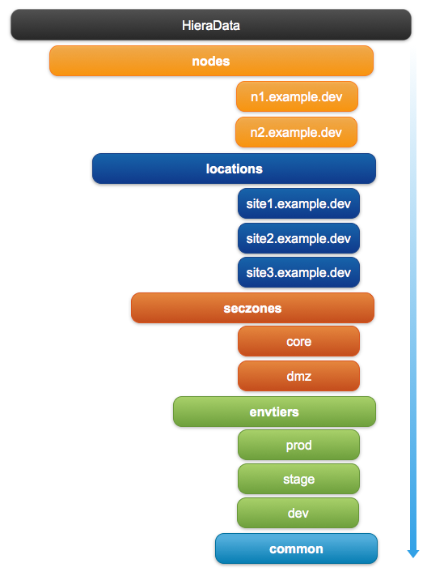

## Overview

#### What is Hiera ?

Hiera is a ordered hierarchical key/value data store/lookup tool for configuration data

**Hierarchical Data Store**: an organizational structure in which items are ranked according to levels of importance

#### Why Hiera ?

Hiera makes Puppet better by keeping **site-specific data out of your manifests**

Benefits:

- Easier to configure your own nodes: default data with multiple levels of overrides is finally easy.

- Easier to re-use public Puppet modules: don’t edit the code, just put the necessary data in Hiera.

- Easier to publish your own modules for collaboration: no need to worry about cleaning out your data before showing it around, and no more clashing variable names.

#### What goes into Hiera ?

- Business-specific data (i.e. internal NTP server, VIP address, per-environment java application versions, etc…)
- Data that you don’t want to include in your component modules

#### What DOSN'T go into Hiera ?

- OS-specific data
- Data common to the component modules everyone needs to know (paths to config files, package names, etc…)
- Sensitive data ( Password, Keys ) - **Unless your using eyaml/eyaml-gpg**

## Hierarchical Structure

The hierarchial structure is **NOT** definded and can be configured to meet **your** specific needs.  Thus hiera does not have any requirements for the hierarchial structure.

An example strucuture uses **nodes**, **locations**, secruity zones(**seczones**), environment tiers(**envtiers**) and **common** as the structure.



This sample structure provides the granular ability to set/configure **site-specific** data at multiple layers

**Nodes(FQDN)**: Node specific data

**Locations**: Data specific to a site or location. Such as different data centers

**Security Zones(seczones)**: Data specific to security zones, such as dmz vs core (**protected**).
  
**Environment Teirs**: Data specific to environment tiers such as production, stage, dev, qa...etc.

**Common**: "Global" data that is common among **ALL** nodes.  This is used as a last match catagory.

## Creating Hierarchy

The hierarchical structure contains two types of elements its [data sources](https://docs.puppetlabs.com/hiera/1/data_sources.html):

- **Static data source** — A hierarchy element without any [interpolation tokens](https://docs.puppetlabs.com/hiera/1/variables.html). A static data source will be the same for every node.

- **Dynamic data source** — A hierarchy element with at least one [interpolation tokens](https://docs.puppetlabs.com/hiera/1/variables.html). If two nodes have different values for the variables it references, a dynamic data source will use two different data sources for those nodes.

Hiera’s variables can come from a variety of sources, depending on how Hiera is invoked.  When used in combination with Puppet, Hiera automatically recieves all of Puppet’s current [variables](https://docs.puppetlabs.com/puppet/latest/reference/lang_variables.html)

This includes [facts and built-in variables](https://docs.puppetlabs.com/puppet/latest/reference/lang_variables.html#facts-and-built-in-variables), as well as local variables from the current scope. Most users will almost exclusively interpolate facts and built-in variables in their Hiera configuration and data.

To ultilize facts and built-in variables, remove Puppet’s **$** (dollar sign) prefix when using its variables in Hiera. (That is, a variable called $::clientcert in Puppet is called ::clientcert in Hiera.)

#### Best Practices

- Usually avoid referencing user-set local variables from Hiera. Instead, use facts, built-in variables, top-scope variables, node-scope variables, or variables from an ENC whenever possible.

- When possible, reference variables by their fully-qualified names (e.g. %{::environment} and %{::clientcert}) to make sure their values are not masked by local scopes.

> These two guidelines will make Hiera more predictable, and can help protect you from accidentally mingling data and code in your Puppet manifests.


## Configuration

Hiera’s config file is usually referred to as hiera.yaml. Use this file to configure the hierarchy, which backend(s) to use, and settings for each backend.

Used in combination with Puppet the default config file location is $confdir/hiera.yaml, which is usually one of the following:

- /etc/puppet/hiera.yaml in *nix open source Puppet
- /etc/puppetlabs/puppet/hiera.yaml in *nix Puppet Enterprise
- COMMON_APPDATA\PuppetLabs\puppet\etc\hiera.yaml on Windows

#### Format

Hiera’s config file must be a YAML hash. The file must be valid YAML, but may contain no data.

Each top-level key in the hash must be a Ruby symbol with a colon (:) prefix. 

Available settings are listed at “[Global Settings](https://docs.puppetlabs.com/hiera/1/configuring.html#global-settings)” and “[Backend-Specific Settings](https://docs.puppetlabs.com/hiera/1/configuring.html#backend-specific-settings)”.

````
---
:backends:
  - yaml
:logger: console
:hierarchy:
  - "nodes/%{::clientcert}"
  - "locations/%{::location}"
  - "seczones/%{::seczone}"
  - "envtiers/%{::envtier}"
  - common
````

## Data Source(s)

Within a data source, you can interpolate values into any string, whether it’s a standalone value or part of a hash or array value. This can be useful for values that should be different for every node, but which differ **predictably**:

````
# /var/lib/hiera/common.yaml
---
ntpserver: "ntp.%{::domain}"
````

As well as basic values data source can contain hashes of data that can be looked up via the [hiera_hash](https://docs.puppetlabs.com/references/latest/function.html#hierahash) function

**Hiera_Hash Lookup Function**

````
$myvhosts = hiera_hash('apache::vhosts', {})
create_resources('apache::vhost', $myvhosts)
````
**Data Source Hash**

````
apache::vhosts:
  "%{::fqdn}":
    port: '80'
    docroot: '/var/www/html'
    priority: '25'
    default_vhost: true
    directories:
      -
        path: '/var/www/html'
        allow:
          - 'from 127.0.0.1'
          - 'from ::1'
        options:
          - 'Indexes'
          - 'FollowSymLinks'
          - 'MultiViews'
  "%{::fqdn}-ssl":
    port: '443'
    docroot: '/var/www/html'
    priority: '25'
    ssl: true
    ssl_cert: "/etc/pki/tls/certs/%{::fqdn}-server.crt"
    ssl_key: "/etc/pki/tls/private/%{::fqdn}-server.key"
    ssl_ca: '/etc/pki/tls/certs/ca.crt'
    ssl_verify_client: 'require'
    ssl_verify_depth: '3'
    ssl_proxyengine: true
    proxy_pass:
      -
        path: '/'
        url: "https://foreman.%{::domain}/"
````

## Lookups

Hiera always takes a lookup key and returns a **single value** (of some simple or complex data type), but it has several methods for extracting/assembling that one value from the hierarchy. We refer to these as “lookup methods.”

Hiera uses the [priority lookup method](https://docs.puppetlabs.com/hiera/1/lookup_types.html#priority-default) as its default, which gets a value from the **most specific** (**a.k.a first match wins**) matching level of the hierarchy. Only one hierarchy level — the first one to match — is consulted

Priority lookups can retrieve values of any data type (strings, arrays, hashes), but the entire value will come from **only one** hierarchy level.

> Consult the [Puppetlabs Hiera Documentation](https://docs.puppetlabs.com/hiera/1/lookup_types.html) for details on additonal lookup methods.

#### When to use hiera, hiera\_array and hiera\_hash lookup funcitons ?

The short answer is to use hiera whenever you expect to need a single lookup from a single part of your hierachy. If you need to merge value across the matching parts of your hierarchy, then you'll need hiera_hash or hiera_array

[hiera](https://docs.puppetlabs.com/references/latest/function.html#hiera) - Performs a standard priority lookup and returns the most specific value for a given key. The returned value can be data of any type (strings, arrays, or hashes).

[hiera_array](https://docs.puppetlabs.com/references/latest/function.html#hieraarray) - Returns all matches throughout the hierarchy — not just the first match — as a flattened array of unique values. If any of the matched values are arrays, they’re flattened and included in the results.

[hiera_hash](https://docs.puppetlabs.com/references/latest/function.html#hierahash) - Returns a merged hash of matches from throughout the hierarchy. In cases where two or more hashes share keys, the hierarchy order determines which key/value pair will be used in the returned hash, with the pair in the highest priority data source winning.

## Dynamic Environments

On each puppet run the ````$confdir/hiera.yaml````  is consulted, thus any configurations must be in this file.  Because of this you can **NOT** have hierarchies per environment. 

The ````$datadir```` is an environment aware namespace that is filled at run time, it can consult a specific environments datadir ````$confdir/environments/$environment/hieradata/````

To configure Hiera for dynamic environments configure the ````datadir``` property 

````
:datadir: /etc/puppet/environments/%{::environment}/hieradata
````

##Terminology

## References

[PuppetLabs Hiera 1 Overview](https://docs.puppetlabs.com/hiera/1/)

[Hiera Lookup Types](https://docs.puppetlabs.com/hiera/1/lookup_types.html)

[The hiera.yaml Config File](https://docs.puppetlabs.com/hiera/1/hierarchy.html)

[Hiera Data Sources](https://docs.puppetlabs.com/hiera/1/variables.html#in-data-sources)

[When to use hiera, hiera_array, and hiera_hash?](https://ask.puppetlabs.com/question/13592/when-to-use-hiera-hiera_array-and-hiera_hash/)


 
