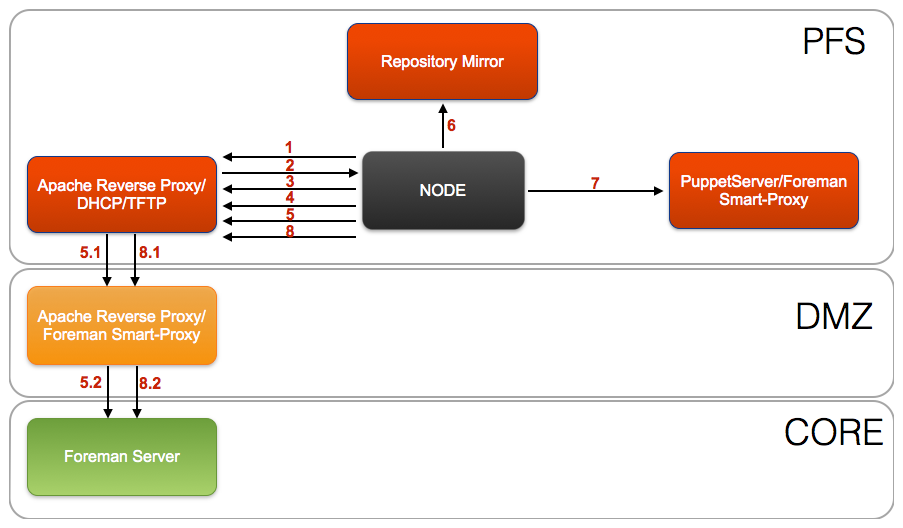

##Overview

Details the communcation path between Nodes, Puppet and Foreman for both a Puppet run and Foreman provisioning.

The architecutre resides over multiple security zones PFS(External), DMZ and CORE.  These security zones are like the layers of an oninion and access inbound from one security zone to another is restricted by a set of firewalls.  

As a rule inbound traffic can only pass to the adjacent security zone and can not 'hop' security zones.  An example is that traffic from the PFS security zone can not communicate directly with the CORE secuirty zone.

To allow PuppetServers(Masters) in the PFS and DMZ security zones to request a nodes ENC output as well as submit facts and reports back to the Foreman server located in the CORE security zone a Apache SSL reverse proxy is used.

This provides a better security model by limiting the access directly from the PFS sercurity zone and providing a single point of entry from the DMZ security zone into the CORE sercurity zone.

##Secure Communication

To provide a secure communication path from the PuppetServer/Foreman Smart-Proxy back to the Foreman Server, the Apache reverse SSL proxy is configured with both client and server SSL communication.

> The architechture requires all certificates used for communicaiton by the Foreman Server, Apache reverse SSL proxy and Foreman Smart-Proxies are all signed by the same certificate authority (CA)

PuppetServers/Foreman Smart-Proxies that are connecting to the Apache reverse SSL proxy are required to have PKI client certificates that is signed by the same certificate authority (CA) as the Apache reverse proxy PKI server certificate.

Foreman Server inturn requires that the Apache reverse SSL proxy provide a client certificate that is signed by the same certificate authority (CA) as the certificate Foreman is configured to communicate with its Foreman Smart-Proxies.

##Puppet Run Communication Flow

####Core Security Zone

1. Node send **facts** to PuppetServer
1. PuppetServer obtains ENC data from Foreman
1. PuppetServer sends compiled **catalog** to Node
1. Node sends **report** information back to PuppetServer
1. PuppetServer sends **report** information and **facts** to Foreman

####DMZ Secruity Zone

1. Node send **facts** to PuppetServer
1. PuppetServer requests ENC data though the Apache reverse proxy in the DMZ security zone
    1. Apache reverse proxy in the DMZ security zone forwards request to Foreman in the CORE security zone
1. PuppetServer sends compiled **catalog** to Node
1. Node sends **report** information back to PuppetServer
1. PuppetServer sends **report** information and **facts** though Apache reverse proxy in the DMZ security zone
    1. Apache reverse proxy in the DMZ security zone forwards **report** information and **facts** to Foreman in the CORE security zone

####PFS Security Zone

1. Node send **facts** to PuppetServer
1. PuppetServer requests ENC data though Apache reverse proxy in the DMZ security zone
    1. Apache reverse proxy in the PFS security zone forwards request to Apache reverse proxy in the DMZ security zone
    1. Apache reverse proxy in the DMZ security zone forwards request to Foreman in the CORE security zone
1. PuppetServer sends compiled **catalog** to Node
1. Node sends **report** information back to PuppetServer
1. PuppetServer sends **report** information and **facts** though the Apache reverse proxy in the PFS security zone
    1. Apache reverse proxy in the PFS security zone forwards **report** information and **facts** to Apache reverse proxy in the DMZ security zone
    1. Apache reverse proxy in the DMZ security zone forwards **report** information and **facts** to Foreman in the CORE security zone

##Foreman Provisioning Communication Flow

####Core Security Zone

1. Node PXE client broadcasts **DHCPDISCOVER**
1. DHCP server send **DHCPOFFER** including **IP address** and **PXE file** location
1. Node PXE client obtains the **boot image** from the TFTP server
1. Boot image searches the **pxelinux.cfg directory** on the TFTP server for boot configuration file
1. Node obtains the **provisioning (kickstart) file** from the Foreman server
1. Kickstart installs from a remote installation tree on the Repository Mirror server
1. Kickstart executes a Puppet run on the Node
1. Node reports to the Foreman server it was built

####DMZ Security Zone

1. Node PXE client broadcasts **DHCPDISCOVER**
1. DHCP server send **DHCPOFFER** including **IP address** and **PXE file** location
1. Node PXE client obtains the **boot image** from the TFTP server
1. Boot image searches the **pxelinux.cfg directory** on the TFTP server for boot configuration file
1. Node obtains the **provisioning (kickstart) file** though the Apache reverse proxy in the DMZ security zone
  1. Apache reverse proxy in the DMZ security zone forwards request to Foreman in the CORE security zone
1. Kickstart installs from a remote installation tree on the Repository Mirror server
1. Kickstart executes a Puppet run on the Node
1. Node reports to the Foreman server it was built though the Apache reverse proxy in the DMZ security zone
  1. Apache reverse proxy in the DMZ security zone forwards report to Foreman in the CORE security zone

####PFS Security Zone

1. Node PXE client broadcasts **DHCPDISCOVER**
1. DHCP server send **DHCPOFFER** including **IP address** and **PXE file** location
1. Node PXE client obtains the **boot image** from the TFTP server
1. Boot image searches the **pxelinux.cfg directory** on the TFTP server for boot configuration file
1. Node obtains the **provisioning (kickstart) file** though the Apache reverse proxy in the PFS security zone
  1. Apache reverse proxy in the PFS security zone forwards request to Apache reverse proxy in the DMZ security zone
  1. Apache reverse proxy in the DMZ security zone forwards request to Foreman in the CORE security zone
1. Kickstart installs from a remote installation tree on the Repository Mirror server
1. Kickstart executes a Puppet run on the Node
1. Node reports to the Foreman server it was built though the Apache reverse proxy in the DMZ security zone
  1. Apache reverse proxy in the PFS security zone forwards report  to Apache reverse proxy in the DMZ security zone
  1. Apache reverse proxy in the DMZ security zone forwards report to Foreman in the CORE security zone

## Multi-Site CORE Security Zone, Puppet Run Communication Flow 

It is common to have a setup with multiple sites that have both a **DMZ** and a **CORE** security zone. In this senario to abide with the security policy of not 'hopping' security zones and only  passing traffic to the adjacent security zone. The Puppet server in the 'passive' site **CORE** security zone needs to utilize the Apache reverse SSL Proxy to foward its **report** information and **facts** to the Foreman server in the 'active' site CORE security zone.

> Local communication between the Puppet server and its local nodes still behaves has described above

