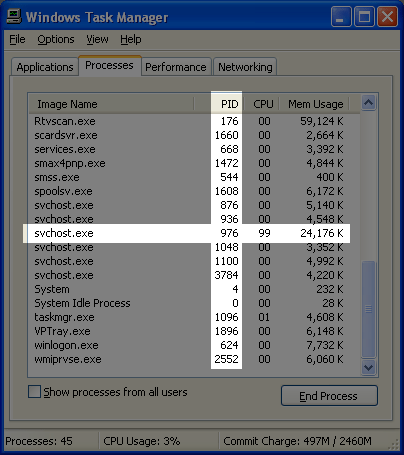
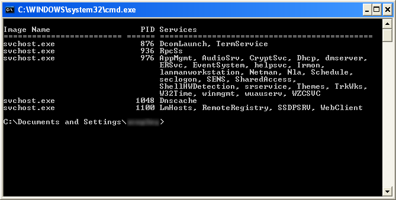

# Process svchost.exe Takes Up 99% CPU

This turned out to be the Wireless Zero Config, which was not shutdown properly by the Intel PROset Wireless tools as it should have been. For the sake of those stumbling across this later via a search I'd like to add my solution

1. Open up taskmgr (Ctrl + Shift + Esc) and show the PID (Process Identifier) column. (View → Select Columns…)
1. Locate the offending instance of SVCHOST and the corresponding PID.

1. Start → Run… → cmd /k tasklist /svc /fi “imagename eq svchost.exe”
1. Match the offending PID to possible services. In my example there's a lot it could be.

1. Start → Run… services.msc
1. Start playing process of elimination… I haven't figured out a better way to do this part…

